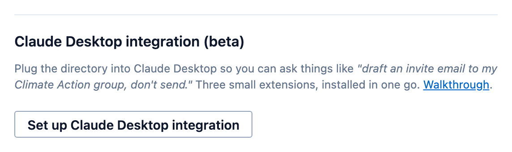
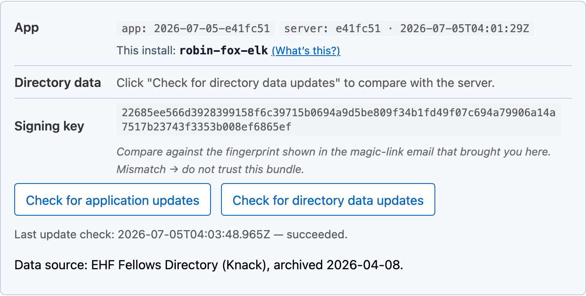
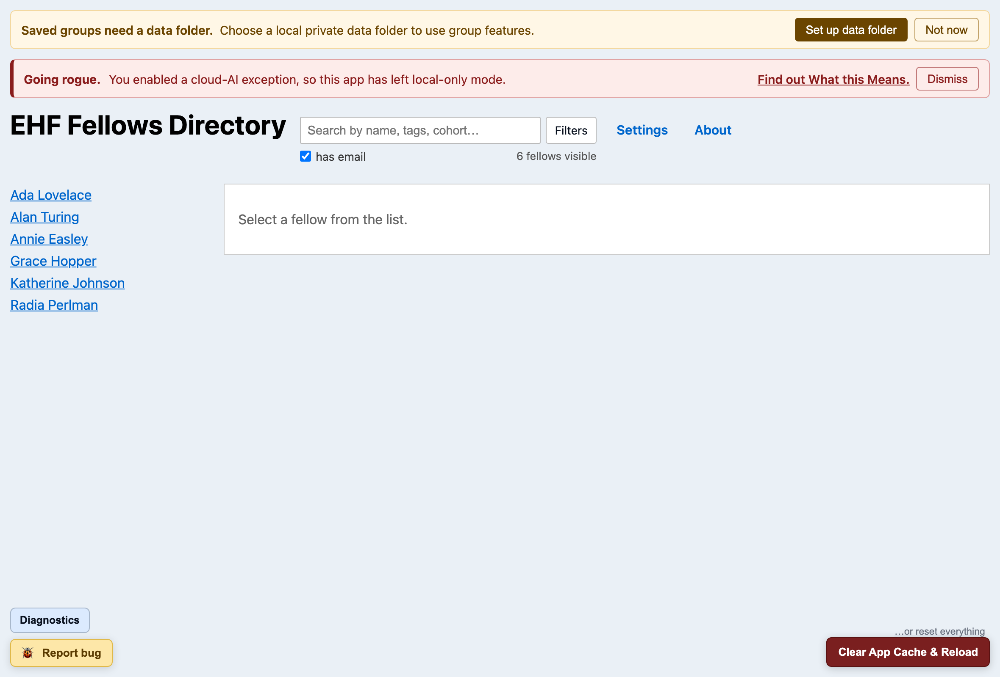
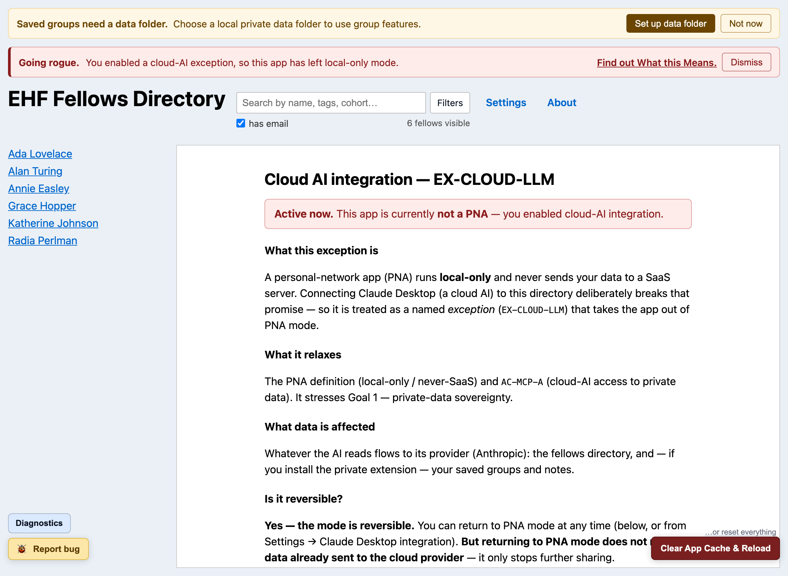
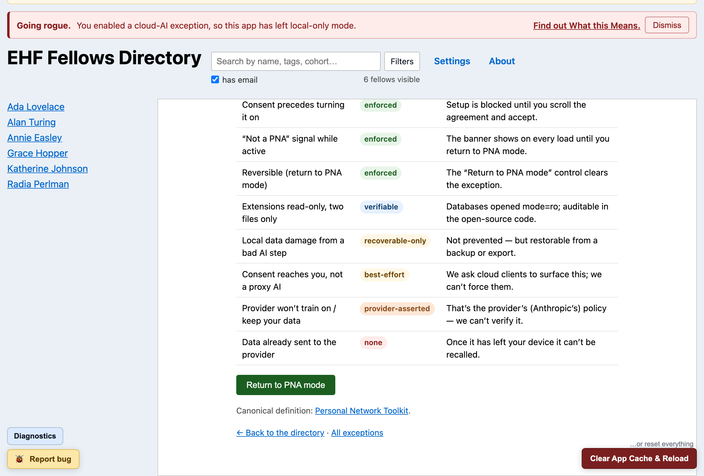
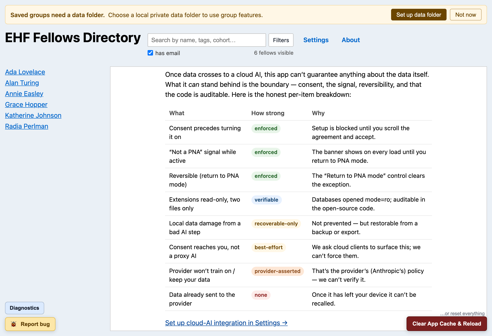

# External access & AI — a visual walkthrough

*How the EHF Fellows Directory handles everything that crosses the edge of your device — what ever
touches a network, what an AI can see, what it can change (spoiler: nothing), and exactly what the
app shows you at every decision point. A plain-language companion to the
[User Guide](../users_manual.md), the [Claude Desktop setup guide](../use_with_claude_desktop.md)
(the how-to), and [`Architecture.md`](../Architecture.md) (the formal commitments this document
explains). The sibling reference design has the same style of walkthrough —
[PRM's AI reads & writes](https://github.com/richbodo/prm/blob/main/docs/explainers/ai-reads-and-writes-walkthrough.md)
— and comparing the two is a good way to see the shared design language.*

> Every screenshot below is the real app, driven through each state against a **synthetic demo
> directory** (Ada Lovelace, Grace Hopper, …) — no real fellow's data appears in this document.

---

## The idea in one minute

The Fellows app is **local-only by design** — a [Never-SaaS](../never-saas.md) app. After install,
your copy of the directory and everything you author (groups, tags, notes) lives on your device;
there is no account, no per-user storage on any server, and the app keeps working with the server
gone.

Everything that *does* cross the edge of your device falls into exactly two categories:

1. **The delivery channel** — a small, bounded set of server contacts that exist to hand you the
   app and the data, then get out of the way (Part 1).
2. **The cloud-AI exception** — an *optional* integration you can turn on to let Claude Desktop
   read your directory, which the app treats as a named, visible, reversible departure from its
   own rules (Parts 2–5).

The design answer to both is the same shape as PRM's: **a protective default, and explicit,
visible, reversible exceptions on top of it.** And the safety is held by **consent and honest
signaling, not detection** — an app cannot reliably know which AI is on the other end of an
integration, so this one never pretends to. Where a guarantee is strong, it says so; where it's
weak, it says that too (see [the strength profile](#what-the-exception-does--and-doesnt--protect)).

---

# Part 1 — What touches a network at all (before any AI)

Three things, ever:

| Contact | When | What crosses |
| --- | --- | --- |
| **The magic-link gate** | once, at install (and at re-auth) | your email address, checked against the fellowship allowlist; a session cookie comes back |
| **Downloading the app + directory data** | at install; afterwards **only when you click** *Check for updates* / *Update directory data* on the About page | bundle and database bytes come *down*; nothing of yours goes *up* |
| **Anonymous error reports** | when the app hits an internal error | a sanitized, rate-limited error event — scrubbed of contact data before it leaves ([details](../email_gate.md#client-error-reporting)) |

That's the whole list. There is no analytics, no sync, no background polling — the app never
phones home on a schedule, and the server has no `/api/groups`, no `/api/settings`, no per-user
anything. Your groups and notes **cannot** be on a server, because no server endpoint exists that
could receive them. (The formal version of this promise is
[`never-saas.md`](../never-saas.md) and the AC-2 / AC-5 rows in
[`Architecture.md`](../Architecture.md); the risk comparison against the old SaaS directory is
[`local_vs_saas_risk.md`](../local_vs_saas_risk.md).)

Everything after this point is about the **optional** cloud-AI integration — if you never set it
up, Part 1 is the complete story of your data and the network.

---

# Part 2 — What an AI can see (reads)

You can connect **Claude Desktop** to the directory through three small **local MCP servers** — a
standard way for an app to hand tools to an AI. They're deliberately split along the app's privacy
boundary, so each one can be wired up (or not) on its own:

| Extension | What it reads | What the AI can do with it |
| --- | --- | --- |
| **Fellows directory** (`shared_data_ops`) | the **Shared** directory (`fellows.db`) — the same records every fellow gets | search, look up a fellow, read directory stats |
| **Your saved groups** (`private_data_ops`) | your **Private** data (`relationships.db`) — groups, joined to fellow names | list your groups, fetch a group's members |
| **Communications** (`comms`) | nothing — it only formats | stage an email draft as a `mailto:` link **for you to review** |

Three properties hold for all of them, and they're checkable in the open-source code — not
promises:

- **Read-only at the database level.** Both databases are opened in SQLite's read-only mode
  (`mode=ro`). Even a buggy or misled AI cannot change your data through these tools, because no
  write path exists.
- **Stage-only for outreach.** The comms extension returns a pre-filled `mailto:` link. *It never
  sends anything.* Your mail client opens with the draft, and the send button is yours — the AI
  proposes, you dispose. (This staging rule is a standing invariant of the whole app — the same
  one behind export previews — formalized as the [User-mediation
  attestation](../Architecture.md#user-mediation-attestation).)
- **Same data you can already see.** The tools expose exactly the records the app shows you —
  nothing hidden, no elevated view.

The control surface for all of this lives in **Settings → Claude Desktop integration (beta)**:

## Where the AI's private data actually comes from

The *Your saved groups* extension reads `relationships.db` **directly from your data folder** — a
real file on your disk that you picked and can see in Finder. That's deliberate: the app's normal
browser storage is a sealed sandbox no outside tool can read, and attaching a data folder is the
step that dissolves that boundary *on your terms* (a platform constraint the architecture handles
honestly — `CST-PWA-SANDBOX-SEALED` in [`Architecture.md`](../Architecture.md)). No folder
attached → there is no private-data file on disk for *any* external tool to read, and the setup
dialog warns you about exactly that (visible in the screenshots below).

And because the directory data carries its own **embedded provenance**, you always know what
dataset the AI is reading and where it ultimately came from — the About page reads it from the
data itself:

---

# Part 3 — The consent gate (EX-CLOUD-LLM)

Everything in Part 2 is local machinery. The catch is *who's driving it*: Claude Desktop sends
what its tools read to Anthropic's servers to think about. Connecting it therefore does the one
thing this app is built never to do — send your data to a SaaS vendor. So the app **stops you and
makes the tradeoff explicit** before anything is downloaded:

The agreement is short and honest about the two real risks: **your data leaves the local-only
model** (once sent to a cloud provider, no app can guarantee what happens to it), and **MCP + LLMs
are young** (the extensions are read-only and auditable, but an AI driving them can still make
mistakes — the worst case is recoverable because they only touch two files, both restorable from
backups). **Continue is disabled until you've scrolled the agreement to the end and ticked the
box** — the enforced version of "please read this first". Scroll to the end, tick *I understand
and accept these risks*, and Continue lights up.

Accepting is recorded **once per install**, and it does something more interesting than just
starting three downloads: it raises the **`EX-CLOUD-LLM` exception** — a *named* departure from
the app's own rules, defined in the [PNA Toolkit](https://github.com/richbodo/personal_network_toolkit)
spec this app conforms to. Named is the point: instead of quietly becoming a different kind of
app, it declares which promise it is suspending, shows you that state for as long as it lasts, and
gives you a one-click way back.

---

# Part 4 — Living outside PNA mode: the app never lets you forget

The moment consent is recorded, the app leaves **PNA mode** (its normal local-only state), and a
red banner appears at the top of every page:

**Dismiss hides the banner; it does not disconnect anything** — it's an acknowledgement, not an
off switch (the honest labeling matters: a hidden banner with the integration still live would be
the worst of both). The **Find out What this Means** link opens an in-app explainer page,
`#/exception/EX-CLOUD-LLM`, that states the exception's whole contract in plain language — what it
relaxes, what data is affected, and how to reverse it:

## What the exception does — and doesn't — protect

The most unusual part of the explainer is the **strength profile**: a table that grades every
guarantee by how strong it *actually* is, instead of implying everything is equally solid:

Reading it bottom-up is the fastest way to understand the design:

- **none — irreversible**: data already sent to the provider cannot be recalled. The app says this
  outright rather than implying a clean undo it can't deliver.
- **provider-asserted**: what Anthropic does with data it receives is Anthropic's policy. The app
  can't verify it, so it won't claim it.
- **best-effort**: the extensions ask cloud clients to surface consent to a *human* (not just to
  the AI driving them) — but no app can force that.
- **verifiable**: the read-only, two-files-only claim is checkable in the open-source code.
- **enforced**: consent before anything turns on, the persistent not-a-PNA signal, and
  reversibility are properties of the code itself.

---

# Part 5 — Returning to PNA mode: one click back

While the exception is active, a **Return to PNA mode** control sits at the bottom of the
explainer page (and in Settings) — directly beneath the strength profile, so the honest table and
the way out share a screen:

Click it and the exception clears, the banner goes, and the consent gate re-arms (so turning the
integration back on asks you all over again):

Two honest footnotes, both already graded in the strength table: returning to PNA mode stops
*future* sharing but **cannot recall data already sent**, and it doesn't uninstall the extensions
from Claude Desktop — that's a two-click uninstall in Claude Desktop's own settings
([how](../use_with_claude_desktop.md#removing-the-integration)).

---

# Part 6 — What an AI can change (writes)

**Nothing.** This is the shortest section on purpose.

In this app, no AI write path exists at all — not gated, not reviewed: **absent.** The MCP
extensions expose no tool that can create, modify, or delete anything; the databases they read are
opened read-only at the SQLite level; and the one "active" thing an AI can do — draft an email —
produces a staged `mailto:` link that only becomes an action when *you* press send in *your* mail
client.

Every path that changes your data (creating a group, importing a directory update, restoring a
backup) runs through the app's own screens with you at the controls, and every path data takes
*out* (group exports, email composes) shows you the full payload before anything leaves. That's
the app's standing rule — *the proposer stages, the human disposes* — and it's attested with tests
in [`Architecture.md` § User-mediation](../Architecture.md#user-mediation-attestation).

If you're curious what disciplined AI *writes* look like when an app does choose to allow them —
staged proposals, append-only fields, per-field policies — that's PRM's territory:
[AI reads & writes in PRM](https://github.com/richbodo/prm/blob/main/docs/explainers/ai-reads-and-writes-walkthrough.md#part-2--ai-writes-what-an-ai-can-change).
If this app ever grows an in-app AI, the commitment is already pinned: it will be a *proposer*
subject to the same review gates, never an actuator.

---

## The semantics, summarized

| Question | Answer | Strength |
| --- | --- | --- |
| What reaches a server in normal use? | magic-link auth, opt-in downloads/updates, sanitized error events — nothing else | enforced (no other endpoints exist) |
| Can an AI see my data without my consent? | no — the integration is off until you scroll + accept the gate | enforced |
| What can a connected AI read? | the shared directory; your groups **only** if you install the private extension (and only via a data folder you chose) | enforced (per-extension split) |
| Can a connected AI change my data? | no — no write tool exists; databases open read-only | enforced + verifiable |
| Can a connected AI send email? | no — it stages a draft; your mail client, your click | enforced (stage-only) |
| Will I know the integration is on? | a persistent red banner until you return to PNA mode | enforced (signal) |
| Can I turn it off? | one click — Return to PNA mode; consent re-arms | enforced (mode only) |
| What happens to data already sent? | it cannot be recalled | none — irreversible |
| Which AI is on the other end? | unknowable by the app; the boundary is consent + honesty, not detection | not enforceable |
| Where did the data itself come from? | embedded provenance — hop 0 is the 2026-04-08 Knack archive, readable in-app and by any importer | verifiable (in the data) |

---

## Honest limits (the part most tools skip)

- **The app cannot identify the AI on the other end.** MCP client identity is self-reported, so
  the extensions can't tell a local model from a cloud one — the protection is the consent gate
  and the banner, never detection. Wire them to a local model for the strongest posture
  ([the caveat, in depth](../../mcp_servers/README.md#cloud-llm-caveat-read-this-if-your-mcp-client-is-hosted)).
- **A cloud provider's data handling is the provider's policy.** Graded *provider-asserted* in the
  strength profile; the app can't verify it and says so.
- **Claude Desktop's own install warning is not this app's consent.** During install, Claude
  Desktop shows a red "access to everything on your computer" banner for *any* unverified
  extension — it's their generic warning, far broader than what these extensions do. The accurate
  description of the real tradeoff is the consent gate in Part 3
  ([more](../use_with_claude_desktop.md#more-about-that-red-warning-banner)).
- **A data folder is a real folder.** Attaching one is what lets outside tools (including the MCP
  extensions) read your private data file — that's its purpose — and any program running as your
  OS user can read your disk. That boundary belongs to the operating system, not to any app.

## For developers

The formal versions of everything above, with tests as the evidence: the
[Exception attestation](../Architecture.md#exception-attestation-non-pna-mode) (EX-CLOUD-LLM,
handler clauses EX-H1–H8), the
[User-mediation attestation](../Architecture.md#user-mediation-attestation) (UM-1/2/3 + the
mediated-boundary registry), the
[Constraint attestation](../Architecture.md#constraint-attestation) (the sandbox/folder story),
the MCP tool contracts in the
[PNA Toolkit spec](https://github.com/richbodo/personal_network_toolkit/tree/main/spec/contracts),
and the e2e suites that pin the flows in this document:
`tests/e2e/test_pna_exception_mode.py`, `tests/e2e/test_mcpb_settings.py`,
`tests/e2e/test_sandbox_sealed_mcp.py`, and `tests/test_private_data_ops.py` /
`tests/test_comms.py` (the read-only / stage-only proofs).
